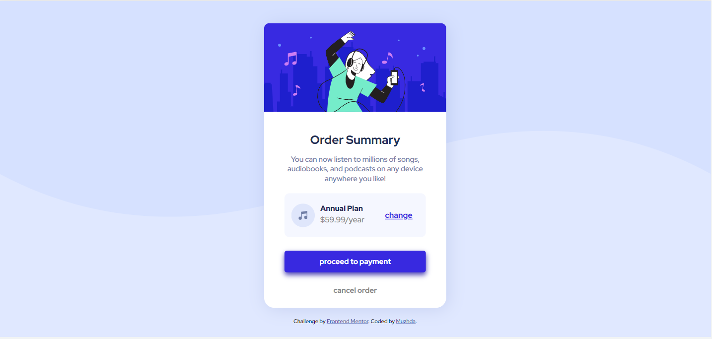
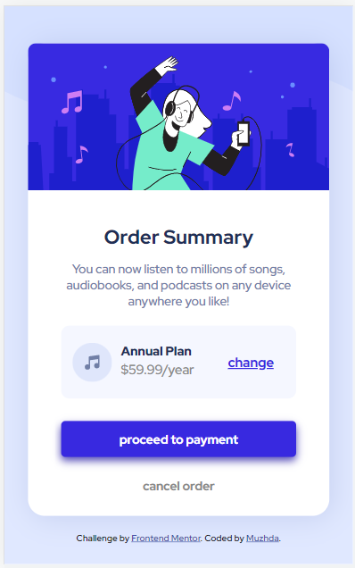

# Frontend Mentor - Order summary card solution

This is a solution to the [Order summary card challenge on Frontend Mentor](https://www.frontendmentor.io/challenges/order-summary-component-QlPmajDUj). Frontend Mentor challenges help you improve your coding skills by building realistic projects. 

## Table of contents

- [Overview](#overview)
  - [The challenge](#the-challenge)
  - [Screenshot](#screenshot)
  - [Links](#links)
- [My process](#my-process)
  - [Built with](#built-with)
  - [What I learned](#what-i-learned)
  - [Useful resources](#useful-resources)
- [Author](#author)
- [Acknowledgments](#acknowledgments)

## Overview

### The challenge

Users should be able to:

- See hover states for interactive elements

### Screenshot

#### Desktop View (1440px)

#### Mobile View (425px)

### Links

- Solution URL: [View Solution](https://www.frontendmentor.io/solutions/order-summary-component-using-html-and-css-QIygNLwSs)
- Live Site URL: [View live site](https://muzhdan.github.io/FrontEnd-Mentor_Order-Summary-Component/)

## My process

 I have just completed my first Frontend-Mentor challenge. After being away from coding for months, this challenge was a good warm-up for me. When I started this challenge, I even couldn't recognize the HTML syntax (funny, huh!!!). However,  I still managed to learn the basics of HTML, CSS, and flexbox with the help of Youtube & Google :) 

### Built with

- Semantic HTML5 markup
- CSS custom properties
- Flexbox
- Google Fonts

### What I learned
Through completing this program i was able to learn flexbox, CSS units.

### Useful resources

- [Flexbox video](https://www.youtube.com/watch?v=FTlczfR82mQ&t=381s) - This helped me with understanding Flexbox. 
- [Flexbox interactive website](https://flexboxfroggy.com/) - Flexbox can be quite confusing. Therefore, practice is essential. Using this interactive website I was able to grasp the concept of FlexBox.  It's a great resource for anyone struggling with Flexbox.

## Author

- Frontend Mentor - [@MuzhdaN](https://www.frontendmentor.io/profile/MuzhdaN)

## Acknowledgments

- Youtube 
- Google
